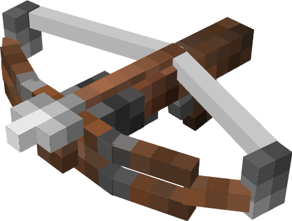

	

<h1 align="center">Re Multi Hookshot</h1>

 

![Minecraft](https://custom-icon-badges.demolab.com/static/v1?style=for-the-badge&label=&message=1.20.x~&color=5fbac9&labelColor=48729c&logo=data:image/png;base64,iVBORw0KGgoAAAANSUhEUgAAABAAAAAQCAYAAAAf8/9hAAAAAXNSR0IArs4c6QAAAARnQU1BAACxjwv8YQUAAAAJcEhZcwAADsMAAA7DAcdvqGQAAAAZdEVYdFNvZnR3YXJlAHBhaW50Lm5ldCA0LjAuMjCGJ1kDAAACoElEQVQ4T22SeU8aURTF/ULGtNRWWVQY9lXABWldIDPIMgVbNgEVtaa0damiqGBdipXaJcY2ofEf4ycbTt97pVAabzK5b27u+Z377kwXgK77QthRy7OfXbeJM+ttqKSXN8sdwbT/A0L7elmsYqrPHZmROLPh5YkV4oEBwaKuHj+yyJptLDoAhbq3O1V1XCVObY3FL24mfn5oRPrcwSCRfQOyNWcjVjZdCbtcdwcgXrXUspdOKbDN/XE9tiBJMhXHT60gUIT2dMhcDLMc3NVKQklz0QIkf5qlyEcO6Qs7yPhMJB4amDMFimQSmqNlE8SKAZFzDfxHfVILIIZ10sJ3OwIbcqSuiOjchkzNCboHev9o2YhgiUP8mxnLN24I6/3ghYdtQG5iUMpFBuCP9iKwLsfiLyeCp2rMnZgwX3NArGoxW1Ridl+BzLEVKa8KSxOqNmDdz0kFnxaLHhWEgAyZigWhHXL+pEDy2ozsDxv8vAzTnh7w5kcghqCaFmCT10of4iPIT2mRdPUh4HoCcVwBH/8Ac2kzUkEV5r3EfVSOvbAJa5NDyI0r2oDtWb1EClh+OoC3Pg7v/Bw7p939yI4rsRW2Y3lKh01eh7WpIRyKZqzyjjYgPdIvlaMWRqYuG7wWryYHsRM0sFolZiPvQ3jheIwSmSBPdkByG/B6Wi3RYiVmRX7GiAPiUCRisii8D+jZNKvPBrHCW1GY0bAz6WkDCtOaSyKQFsi4K5NqNiZtehN2Y5uAShETqolhBqJXpfdPuPsuWwAaRdHSkxdc11mPqkGnyY4pyKbpl1GyJ0Pel7yqBoFcF3zqno5f+d8ohYy9Sx7lzQpxo1eirluCDgt++00p6uxttrG4F/A39sJGZWZMfrcp6O6+5kaVzXJHAOj6DeSs8qw5o8oxAAAAAElFTkSuQmCC)

プレイヤーの移動をめちゃくちゃ快適にする便利ツールを追加します。

 

<h1 align="center">前作からの改良点</h1> 

- 前作、90%コマンド式であった『Multi Hookshot』をScript API(Java Script)を用いることで0から書き直し、様々なバグを修正、改善した。

- 前作の移動方式である「テレポート式」から「ライド式」に変更。
まあつまり、矢みたいなエンティティに乗ることで動きをなめらかにして、また視点の移動ができない問題も解決したってわけ。

- Script API(Java Script)による改善
	- 行動検知の向上。
	- 少なくても常時約300個ほどあった常時実行コマンドを無くし、処理を細かく分け、最適化することによる軽量化。お陰様ですっごく軽くなったので低スペックなハードでも実行できるようになったよ！やったね！
