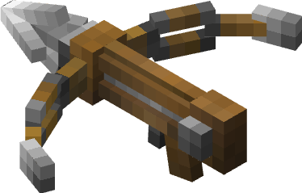

{: align="center"}

{: align="center"}
# Re Multi Hookshot

{: align="center"}
## What's is this
プレイヤーの移動をめちゃくちゃ快適にするツールを追加する。

## 前作からの改良点
前作、90%コマンド式であった『Multi Hookshot』をScript API(Java Script)を用いることで0から書き直し、様々なバグを修正、改善した。
### 修正 / 改善点
- 前作の移動方式である「テレポート式」から「ライド式」に変更。
まあつまり、矢みたいなエンティティに乗ることで動きをなめらかにして、また視点の移動ができない問題も解決したってわけ。

- Script API(Java Script)による改善
	- 行動検知の向上。
	- 少なくても常時約300個ほどあった常時実行コマンドを無くし、処理を細かく分け、最適化することによる軽量化。お陰様ですっごく軽くなったので低スペックなハードでも実行できるようになったよ！やったね！